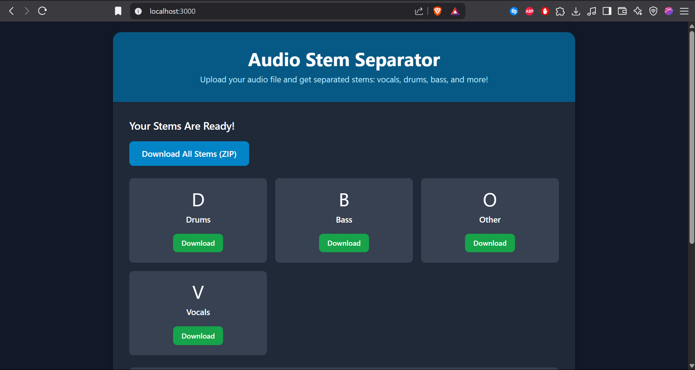

# Audio Stem Separator 🎵


[](https://www.python.org/)
[](https://fastapi.tiangolo.com/)
[](https://developer.nvidia.com/cuda-zone)
[](https://opensource.org/licenses/MIT)

Ever wanted to isolate just the vocals from your favorite song? Or maybe you're a producer who needs to pull out that perfect drum track? This tool uses AI to magically separate audio into individual parts (we call them "stems") - vocals, drums, bass, piano, and more!

## See It In Action

### Web Version

*Just drag, drop, and let the magic happen*


*Watch your audio get separated in real-time*


*Download exactly what you need*

### Desktop App

*Clean, modern interface that's actually fun to use*


*No more wondering "is it done yet?"*


*Your stems, ready to download*

## What Makes This Cool?

**Smart AI Separation** - We're talking studio-quality results that'll make you wonder how it works (spoiler: lots of math and neural networks)

**Super Easy to Use** - Literally just drag your file in. That's it. No PhD in audio engineering required.

**Watch It Work** - See your audio get processed in real-time because waiting without knowing what's happening is the worst

**Get What You Want** - Download individual parts or grab everything at once

**Plays Nice** - Works with pretty much any audio format you throw at it (MP3, WAV, FLAC, you name it)

**Smart Cleanup** - Automatically tidies up so your hard drive doesn't hate you

## Getting Started (The Fun Part!)

### What You'll Need

- Python 3.8 or newer (if you don't have it, grab it from python.org)
- A graphics card with CUDA is nice but not required (it just makes things faster)

### Setting Things Up

**Step 1: Get the code**
```bash
git clone <repository-url>
cd audio-stem-separator
```

**Step 2: Create your own little Python world**
```bash
python -m venv venv
source venv/bin/activate  # Windows folks: venv\Scripts\activate
```

**Step 3: Install the magic**
```bash
pip install -r requirements.txt
```

### Fire It Up!

```bash
python -m app.main
```

Then head over to `http://localhost:8000` and start separating some audio!

## Actually Using This Thing

### For Tinkering Around

**Start the server:**
```bash
uvicorn app.main:app --reload --host 0.0.0.0 --port 8000
```

**Then visit:**
- `http://localhost:8000` for the main app
- `http://localhost:8000/docs` if you want to see all the nerdy API details

### For Serious Business

**Production mode (handles more traffic):**
```bash
uvicorn app.main:app --host 0.0.0.0 --port 8000 --workers 4
```

**Or if you're into Docker:**
```bash
docker build -t audio-stem-separator .
docker run -p 8000:8000 audio-stem-separator
```

### Tweaking Settings

You can customize how things work with these environment variables:

| What | What It Does | Default |
|------|--------------|---------|
| `MODEL_PATH` | Where to find the AI models | `models/` |
| `UPLOAD_DIR` | Where uploaded files go | `uploads/` |
| `MAX_FILE_SIZE` | Biggest file you can upload | `100MB` |
| `GPU_ENABLED` | Use your graphics card for speed | `true` |

## The Desktop App Experience

Want something that feels more like a real program? We've got you covered with a desktop version that's actually pleasant to use.

### What You Need
- Python 3.8+ (same as before)
- PyQt6 (for the pretty interface)
- The main server needs to be running

### Getting It Running

**Install the desktop bits:**
```bash
pip install PyQt6 requests
```

**Start the server first:**
```bash
python -m app.main
```

**Then launch the desktop app:**
```bash
python desktop.py
```

The desktop app gives you drag-and-drop uploading, real-time progress updates, and easy downloading. It's like the web version but feels more like home.

### Just Want the Web Interface?

If you prefer browsers, serve up the web interface like this:

```bash
python -m http.server 3000
```

Then visit [http://localhost:3000](http://localhost:3000) and you're good to go!

## For the API Nerds

If you like diving into technical details, check out:
- Interactive docs: `http://localhost:8000/docs`
- Alternative docs: `http://localhost:8000/redoc`

### What the API Can Do

| How | Where | What |
|-----|-------|------|
| `GET` | `/` | "Hey, are you working?" |
| `POST` | `/upload` | "Here's my audio, do your thing" |
| `GET` | `/status/{task_id}` | "How's my audio coming along?" |
| `GET` | `/download/{task_id}` | "Give me all the stems!" |
| `GET` | `/download/{task_id}/{stem_name}` | "Just the vocals, please" |
| `DELETE` | `/cleanup/{task_id}` | "Clean up after yourself" |
| `GET` | `/tasks` | "Show me everything you're working on" |
| `GET` | `/queue/status` | "How busy are you right now?" |

## What's Under the Hood

We built this with some really solid tools:

**FastAPI** powers the backend (it's fast and handles everything gracefully)

**Custom ML models** do the actual audio separation magic

**Redis** keeps track of the queue (optional but helpful)

**Local storage** keeps your files safe

**CUDA support** makes GPU owners very happy

## Want to Help Make This Better?

We love when people contribute! Check out our [Contributing Guide](CONTRIBUTING.md) to see how you can help make this even more awesome.

## The Legal Stuff

MIT License - basically, use it however you want, just don't blame us if something goes wrong. Full details in the [LICENSE](LICENSE) file.
